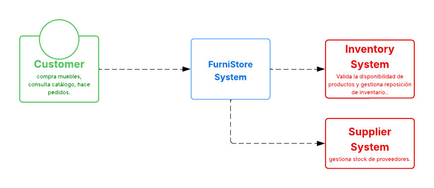
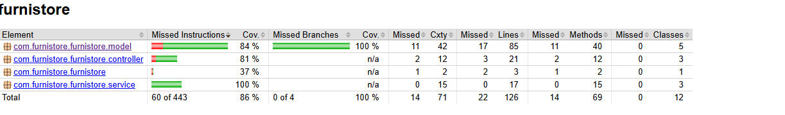

# EquipoRosado-DOSW1-2025

# FurniStore

Breve descripción: FurniStore es una aplicación para la gestión digital de inventario, ventas y entregas de muebles.

## Tabla de contenidos
- Estructura del proyecto
- Diagrama de contexto, casos de uso, diagrama de clases
- Ejecutar tests y generar reporte de cobertura (JaCoCo)

### Diagramas

## Dagrama de contexto 👤

- 👤 **Customer** : Cliente final que consulta el catálogo, compra muebles y realiza pedidos.
- 🖥️ **FurniStore System** : Sistema central de la aplicación que gestiona productos, pedidos, pagos y comunicación con servicios externos.
- 🔗 **Sistemas externos** :
    - **Inventory System**: Valida la disponibilidad de productos y gestiona reposición de inventario.
    - **Supplier System**: Coordina envíos y entregas de pedidos a los clientes.

## 🗂️ Diagrama de Casos de Uso 

- 🔎 **Consultar catálogo de muebles**: el cliente puede navegar y revisar los productos disponibles.
- 🛒 **Realizar pedido**: seleccionar los muebles deseados y crear un pedido en el sistema.
- 💳 **Pagar pedido**: efectuar el pago a través de la pasarela de pagos integrada.
- 📦 **Consultar estado de envío**: verificar el estado de la entrega de sus pedidos.  

## 📊 Diagrama de clases 

# Clases principales

- Se manejaron los nombres en ingles ya que se siguio el consejo del profesor y asi  sera mas practico.

**Product (abstracta)**  
Representa cualquier tipo de producto en la tienda, como sofás, sillas o camas.  
Contiene atributos básicos.  
Permite aumentar o disminuir el stock mediante los métodos increaseStock y decreaseStock.  
Es abstracta para que se puedan crear subtipos específicos de productos en el futuro.

**Customer**  
Representa a un cliente de la tienda.  
Contiene información de contacto.  
Puede realizar pedidos, representados por la relación con la clase Order.

**Order**  
Representa un pedido realizado por un cliente.  
Contiene información del pedido`.  
Permite agregar productos y calcular el total del pedido.

**Inventory**  
Representa el stock disponible de un producto.   
Permite actualizar la cantidad de stock mediante updateStock.

**Supplier**  
Representa a los proveedores que suministran productos a la tienda.  
Contiene información de contacto y métodos para enviar productos al inventario.

## 🧩 Patrones de diseño utilizados 

**Singleton:** para servicios que deben existir una única instancia (por ejemplo, `OrderService`).

**Factory Method:** permite instanciar subtipos de `Product` sin depender de la clase abstracta.

**Repository/Service Layer:** separa la lógica de negocio de los controllers, facilitando pruebas unitarias.

---

## ✅ Principios SOLID aplicados

**S – Single Responsibility:** cada clase tiene una sola responsabilidad (`Product`, `Customer`, `Order`).

**O – Open/Closed:** `Product` es abstracta y se puede extender para nuevos tipos de muebles.

**L – Liskov Substitution:** subclases de `Product` se pueden usar sin alterar el comportamiento del sistema.

**I – Interface Segregation:** cada servicio expone solo los métodos necesarios para su función.

**D – Dependency Inversion:** los controllers dependen de abstracciones (`Service`) y no de implementaciones concretas.

## 📊 Cobertura de pruebas

- Todas las clases modelo, servicios y controllers tienen pruebas unitarias con JUnit 5.

## 🧩 Objetivo de la Semana 2

- Integrar nuevas funcionalidades al sistema e incorporar el módulo de facturación, que permita:

- Generar una factura con los datos del cliente, lista de productos, cantidades y precios unitarios.

- Calcular el subtotal y total de la compra.

    - Aplicar de forma flexible decoradores para:

    - IVA (19%)

    - Descuento (10%)

    - Costos de envío ($25.000)

---
## 🧠 Patrón aplicado: Decorator

- El patrón Decorator permite agregar funcionalidades adicionales a un objeto de forma flexible y dinámica, sin modificar su estructura original.
  En este caso, se utiliza para añadir IVA, descuentos y costos de envío a una factura base, sin alterar la clase principal que calcula el subtotal.
---

### Estado
- Se añadió un módulo de facturación mínimo en `src/main/java/com/furnistore/furnistore/billing`.
- Clases: `BaseInvoice`, `InvoiceItem`, `InvoiceComponent`, `InvoiceDecorator`, `TaxDecorator`, `DiscountDecorator`, `ShippingDecorator`, `InvoiceService`.
- Pruebas unitarias básicas en `src/test/java/com/furnistore/furnistore/billing/InvoiceServiceTest.java`.

## 📊 Diagrama de clases actualizado

#### 🧾 Descripción del Diagrama de Clases - Módulo de Facturación

El diagrama muestra la integración del módulo de facturación al sistema Furniture Store, aplicando el patrón Decorator.
Las clases principales (Customer, Product, Order, Inventory) representan la base del sistema.
El módulo de facturación introduce nuevas clases (InvoiceComponent, BaseInvoice, InvoiceDecorator y sus subclases) que permiten agregar de forma flexible funcionalidades adicionales a una factura, como IVA, descuentos y costos de envío, sin modificar la lógica original.
De esta manera, el sistema mantiene una estructura modular, extensible y coherente con los principios de diseño orientado a objetos.

### Backlog (Historias de usuario)
- HU-1: Como cliente, quiero recibir una factura con el detalle de mis compras y el total con IVA, para tener claridad en el costo final.
    - Criterios de aceptación: La factura muestra items, cantidades, subtotal, IVA aplicado y total.
- HU-2: Como administrador, quiero aplicar descuentos a una factura antes de finalizarla.
    - Criterios: Se puede aplicar un monto fijo de descuento; total no puede ser negativo.
- HU-3: Como cliente, quiero que se añada el costo de envío cuando corresponda.
    - Criterios: El costo de envío se suma al total final.

## 🗓️ Planeación del Sprint - Semana 2

**Objetivo:** Implementar el módulo de facturación para el sistema Furniture Store, aplicando el patrón **Decorator** para añadir de manera flexible responsabilidades como IVA, descuentos y envío.

### 🔀 Ramas del Sprint
- `feature/invoice` → Implementación del núcleo de facturación (BaseInvoice, InvoiceItem, etc.)
- `feature/invoice-decorators` → Decoradores: TaxDecorator, DiscountDecorator, ShippingDecorator.
- `feature/invoice-service` → Servicio para generar factura desde un pedido (Order → Invoice).
- `feature/invoice-tests` → Pruebas unitarias de los componentes de facturación.
- `feature/invoice-docs` → Documentación, diagramas y actualización del README.

- Tareas y estimaciones:
    - T1: Implementar clases base de factura (4h) 
    - T2: Implementar decoradores (IVA, descuento, envío) (4h) .
    - T3: Servicio para generar factura desde Order (3h) 
    - T4: Pruebas unitarias (3h) .
    - T5: Actualizar diagramas y README (2h) .
